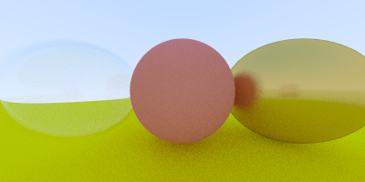

# pathTracer-golang
from the tutorial : http://www.markphelps.me/2016/03/15/writing-a-ray-tracer-in-go.html

## How to use it
Command line parameters: 
  - `--fov`: vertical field of view (degrees) (default:90)
  - `--height`: height of image (default:200)
  - `--out`: output filename  (default:'out')
  - `--samples`: number of samples for anti-aliasing (default:100)
  - `--width`: width of image (default:400)
  - `--debug`: if true render only primitives (no light) (default:false)
  
  
## Work in progress

### Next steps
   - Add new materials
   - Add new geometries (like cube, pyramides, thor, ...)
   - Give some information about the process 
